# Create a development machine on AWS

This workshop module will help you launch a development machine as an EC2 instance on AWS. We will SSH into this machine to use it for the rest of the workshop. The reason for setting up a remote machine and using it via SSH instead of installing all dependencies on your personal machine is so that the workshop can be run even if the workshop venue's wifi is over-burdened, or if your machine already has dependencies that conflict with the dependencies we need to install.

## 1. Create an SSH Key

First, you'll need to select a region. I recommend using `us-east-1` (North Virginia) since this region will be referenced throughout the rest of the workshop. You can change your region by using the drop down just to the left of the "Support" menu in the top menubar:

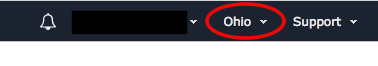

Go to the [EC2 Dashboard](https://console.aws.amazon.com/ec2/home?region=us-east-1#KeyPairs:sort=keyName) and click on Key Pairs in the left menu under Network & Security. Click "Create Key Pair", provide a name (can be anything, make it something memorable) when prompted, and click Create. 

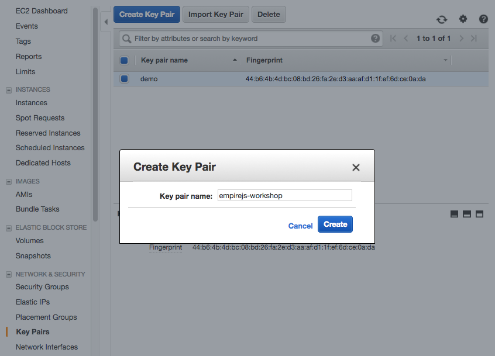

Once created, the private key in the form of .pem file will be automatically downloaded.

&nbsp;

&nbsp;

## 2. Make the SSH key file ready to use

If you're using linux or mac, change the permissions of the .pem file to be less open. For example assuming you named your key "nodejs-workshop":

```
$ chmod 400 ~/.ssh/nodejs-workshop.pem
```

(Note that on Unix machines you should place the key file at the location `~/.ssh`.)

If you're on windows you'll need to download an SSH tool such as [PuTTY](http://www.putty.org/), and convert the .pem file to .ppk to work with putty. Here is a link to instructions for the file conversion - [Connecting to Your Linux Instance from Windows Using PuTTY](http://docs.aws.amazon.com/AWSEC2/latest/UserGuide/putty.html)


&nbsp;

&nbsp;

## 3. Start a development machine

Go the [CloudFormation dashboard](https://console.aws.amazon.com/cloudformation/home?region=us-east-1#/stacks?filter=active), and click "Create Stack".

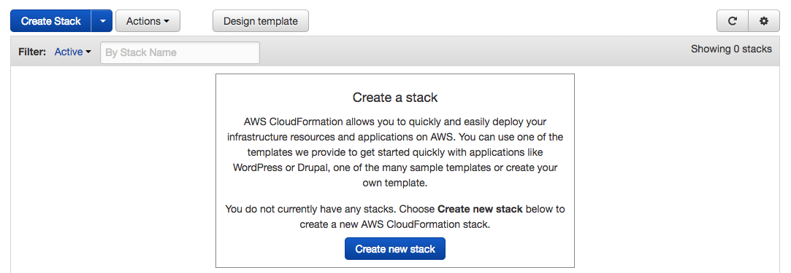

Select "Upload a template to Amazon S3" and choose the file "dev-machine.yml" in this directory of the repository, then click "Next"


Set a name for your stack, and select the key you created in step #1 in the dropdown menu, then click "Next"

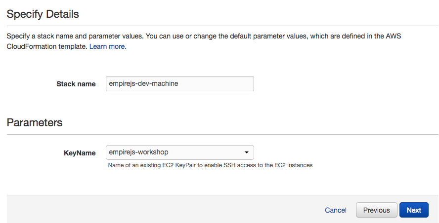

Click Next again, select the checkbox next to "I acknowledge that AWS CloudFormation might create IAM resources." and then click "Create".

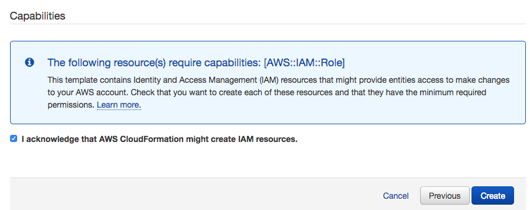

You will see a CloudFormation stack in the `CREATE_IN_PROGRESS` state.

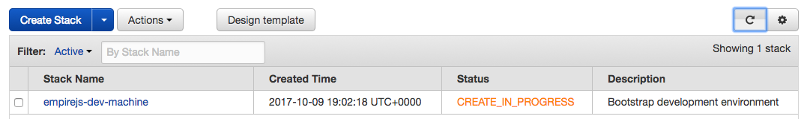

Wait for the stack to transition to `CREATE_COMPLETE` and then check the "Outputs" tab of the stack details to get the IP address of your new remote dev machine:

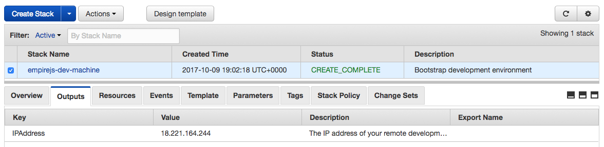


&nbsp;

&nbsp;


## 4. Install Development Tools

SSH into the development machine:

```
ssh -i ~/.ssh/<your key name>.pem ec2-user@<your development instance ip>
```

Example:

```
ssh -i ~/.ssh/nodejs-workshop.pem ec2-user@18.221.164.244
```

(Once again if you are in Windows you will need to use Putty as described in the AWS docs: [Connecting to Your Linux Instance from Windows Using PuTTY](http://docs.aws.amazon.com/AWSEC2/latest/UserGuide/putty.html))

On the first connection you will need to type "yes" to trust the host, since it is unknown since you have never connected to it.

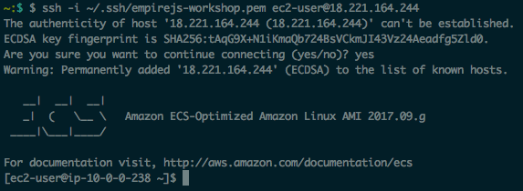

Run the following commands on your development machine to setup the development tools needed to run this workshop:

```
sudo yum install -y git unzip wget nano
curl -O https://bootstrap.pypa.io/get-pip.py
python get-pip.py --user
pip install awscli --upgrade --user
curl -L https://git.io/n-install | bash -s -- -y 6.11.1 && . ~/.bashrc
node -e "console.log('Running Node.js ' + process.version)"
```

&nbsp;

&nbsp;

# (Optional) Secure your AWS account by using an IAM User instead of your root account credentials

## 5. Create an IAM user on your account

Navigate to the [list of IAM users on your AWS account](https://console.aws.amazon.com/iam/home#/users)


Click the "Add User" button and fill out the two fields as indicated then click "Next"

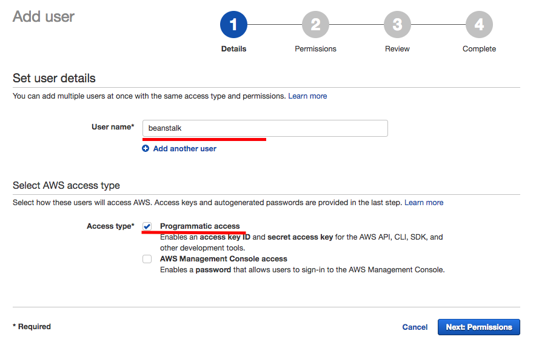

&nbsp;

&nbsp;


## 6. Attach permissions to the IAM user

Select "Attach existing policies directly" tab, then select the "AdministratorAccess" policy. Finally click "Next".

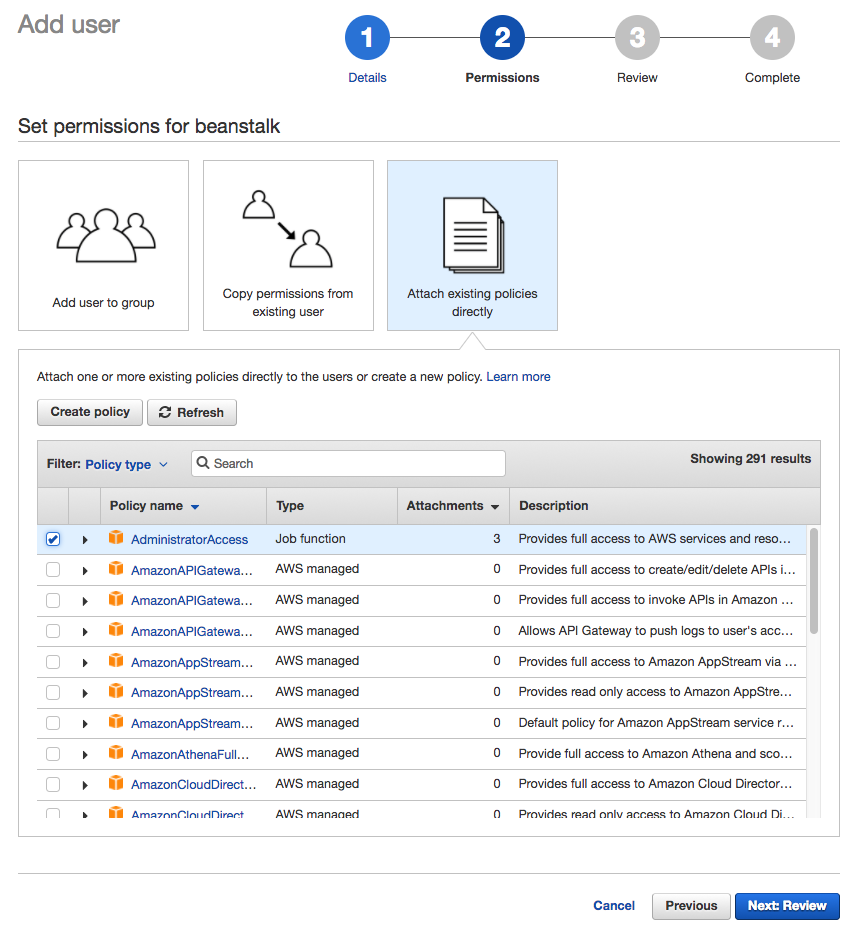

Ensure that the settings on your review page match the image below, then click "Create User".

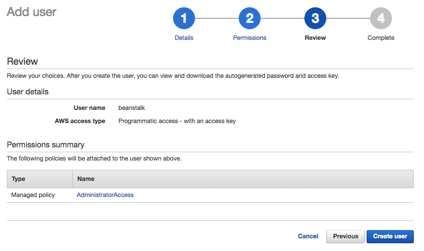

&nbsp;

&nbsp;

## 7. Save credentials for your new user

Click the "Download .csv" button to save the credentials for this user for future use.


