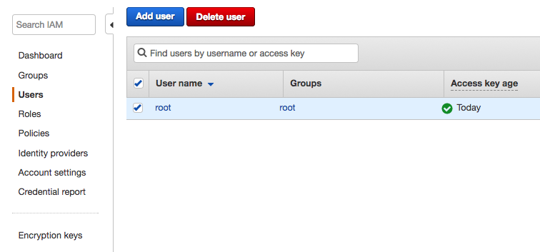
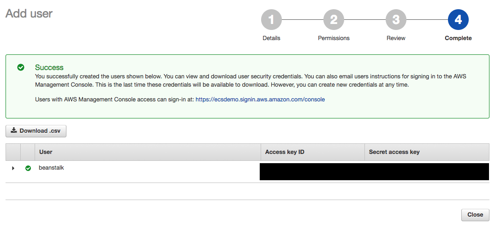

## 1. Start with IAM access for AWS Beanstalk

Navigate to the [list of IAM users on your AWS account](https://console.aws.amazon.com/iam/home#/users)



&nbsp;

## 2. Add an IAM User

Click the "Add User" button and fill out the two fields as indicated then click "Next"


&nbsp;

## 3. Attach permissions to the IAM user

Select "Attach existing policies directly" tab, then select the "AdministratorAccess" policy. Finally click "Next".


&nbsp;

## 4. Review the settings

Ensure that the settings on your review page match the image below, then click "Create User".


&nbsp;

## 5. Save credentials for your new user

Click the "Download .csv" button to save the credentials for this user for future use.



&nbsp;

## 6. SSH into the development instance

If you don't already have an SSH shell open on the development instance open one now:

```
ssh -i ~/.ssh/<your key name>.pem ec2-user@<your development instance ip>
```

&nbsp;

## 7. Clone the workshop repository

Clone the workshop repository using its public endpoint, then switch your current working directory to the elastic beanstalk code directory:

```
cd ~
git clone https://github.com/nathanpeck/empirejs-workshop-nodejs-aws.git
cd empirejs-workshop-nodejs-aws/2\ -\ Elastic\ Beanstalk/code
```

&nbsp;

## 8. Install the Elastic Beanstalk command line tool

Now we will use Python PIP to install the Elastic Beanstalk command line tool. This tool will give us a command line wizard that will help detect details of our project, and automatically deploy it on AWS:

```
pip install awsebcli --upgrade --user
```

&nbsp;

## 9. Initialize an Elastic Beanstalk application in the code directory:

Use the following command to start a new Elastic Beanstalk application in the code directory:

```
eb init
```

This will launch a command line wizard that asks questions about how you want to setup your application.

Complete the wizard as shown below:


The command line tool will automatically detect that this is a Node.js application.

&nbsp;

## 10. Launch an environment for your application:

Use the following command to launch the application your initialized on your account:

```
eb create
```

This will start a command line wizard that asks you a few questions about the environment. You will need to enter your own name for the environment, and choose the "Network" load balancer type:


Note that it will take a few minutes to launch your first environment, since this is creating all the initial resources that are required. Once the environment is created future updates are faster.

&nbsp;

## 11. Verify that your environment is up and running:

Access you environment using the URL that is listed in the Elastic Beanstalk interface:


Here is an example of using curl to fetch a list of users from the API:

```
curl http://empirejs-workshop-dev.us-east-2.elasticbeanstalk.com/api/users
```

Or you can just enter the URL into your browser to check it:


&nbsp;

## 12. Deploy a new version of the application:

You can make any changes that you want to the application, and then roll them out using the following command:

```
eb deploy
```

Note that for any code changes to be reflected when the project being deployed is a Git repo the changes must be committed to the repo, because Elastic Beanstalk always deploys the most recent commit, never uncomitted changes.

&nbsp;

## 13. Shutdown the application

Whe you are done experimenting with Elastic Beanstalk you can shutdown your application. First choose "Terminate Application" from the action menu on your environment:


In the popup dialog enter the environment name to confirm that you really want to delete it, and click "Terminate"


It will take a few minutes for the environment to be cleaned up. You will see events for the environment that indicate that it is being destroyed:


Once you see "terminateEnvironment completed successfully" you can delete the application itself, by using the Action menu on the application:


