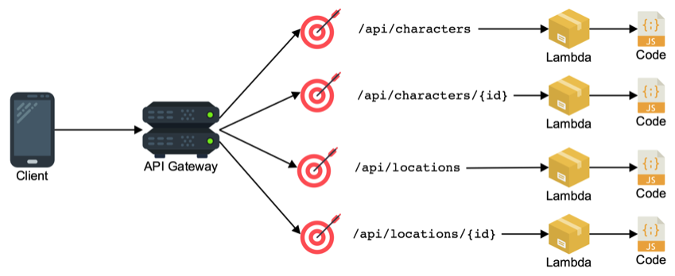
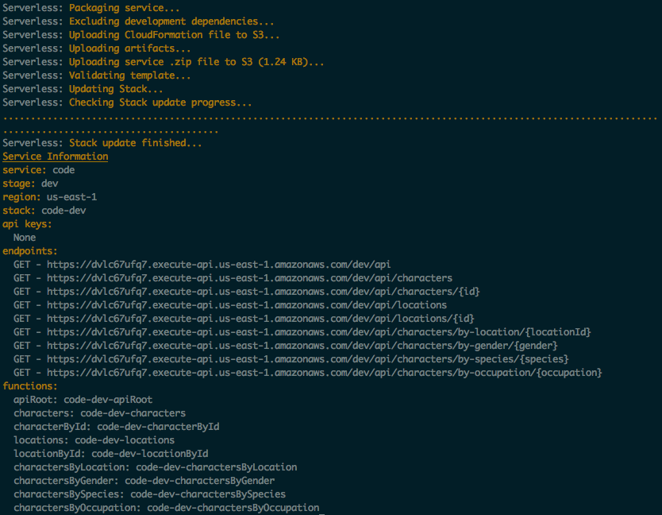
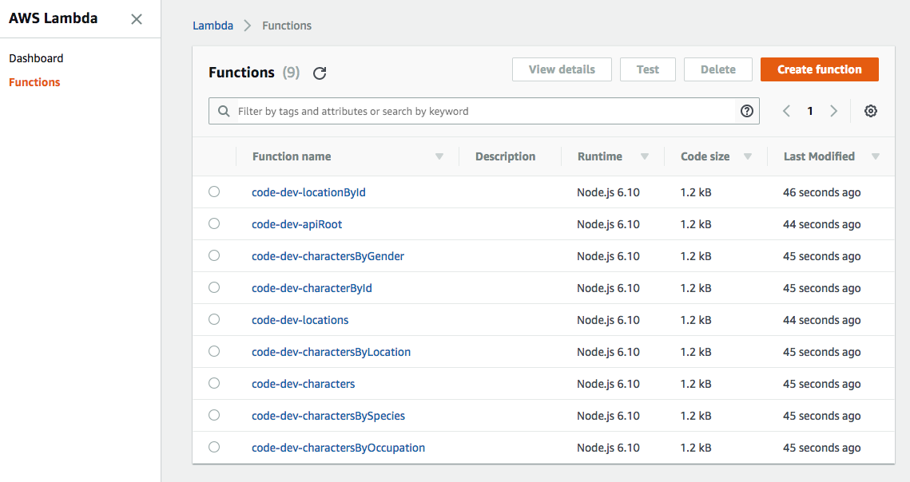
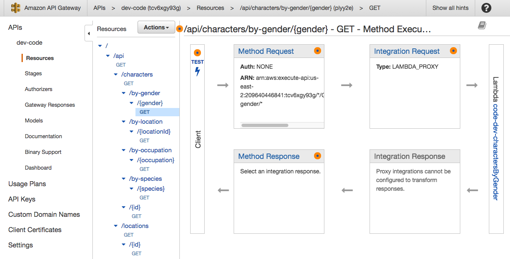
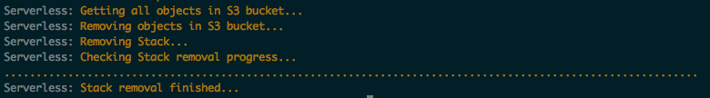

# Node.js deployed on AWS using Serverless + Lambda



In this workshop we will deploy a Node.js API where each API endpoint is powered by a Lambda function. Web traffic reaches the Lambda functions via an AWS API Gateway. The entire architecture is setup and deployed using the [Serverless](https://serverless.com/) framework.

&nbsp;

&nbsp;

## 1. Install serverless on your dev machine

If you have not done so already create [a development machine on AWS](../1%20-%20Development%20Environment) to do this
workshop.

If you don't already have an SSH session open, SSH to your development machine.

```
ssh -i ~/.ssh/<your key>.pem ec2-user@<your dev machine ip address>
```

If you haven't already done so clone the workshop code onto the dev machine:

```
cd ~
git clone https://github.com/nathanpeck/nodejs-aws-workshop.git
```

Then change your current working directory to the right directory for this section of the workshop:

```
cd ~/nodejs-aws-workshop/3\ -\ Serverless\ Lambda/code
```

&nbsp;

&nbsp;

## 2. Install the Serverless framework

Now install the Serverless framework on your dev machine:

```
npm install -g serverless
```

&nbsp;

&nbsp;

## 3. Deploy the application

Change your current working directory to the project directory then deploy using Serverless:

```
cd ~/nodejs-aws-workshop/3\ -\ Serverless\ Lambda/code
serverless deploy
```



&nbsp;

&nbsp;

## 4. Try fetching one of the endpoints

In the output from the previous deploy step you will see a list of the API routes that were setup. Try fetching one of them in your browser.

For example:

```
curl https://dvlc67ufq7.execute-api.us-east-1.amazonaws.com/dev/api/characters
curl https://dvlc67ufq7.execute-api.us-east-1.amazonaws.com/dev/api/characters/by-species/vampire
```

&nbsp;

&nbsp;

## 5. Tour the AWS Lambda console

Check out the AWS console to see a list of the lambda functions that were created by Serverless:



And to see how HTTP traffic gets to your Lambda functions you should check the [API Gateway console](https://us-east-1.console.aws.amazon.com/apigateway/home?region=us-east-1#/apis)



&nbsp;

&nbsp;

## 6. Try modifying a function

You can modify any function, and redeploy by once again running:

```
serverless deploy
```

&nbsp;

&nbsp;

## 7. Cleanup your environment

Destroy all created resources by using

```
serverless remove
```


