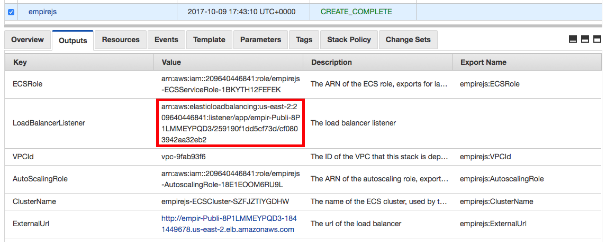
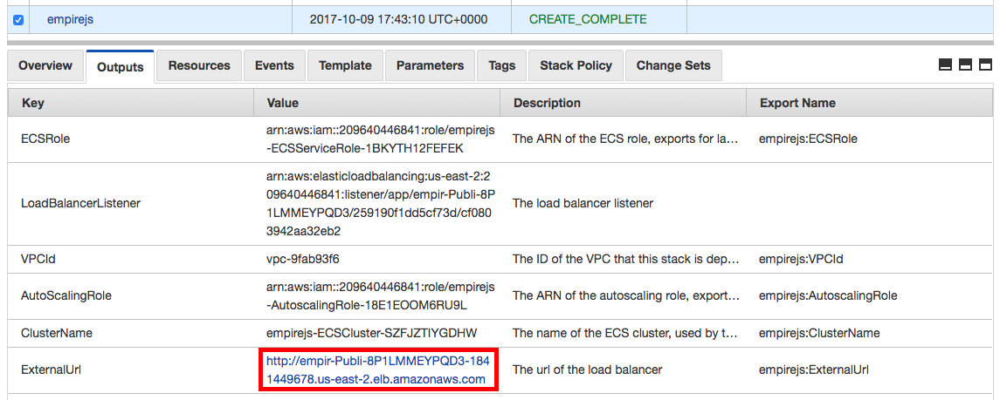
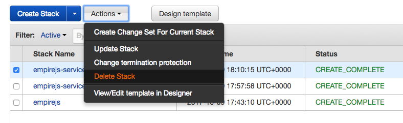

# Node.js deployed on AWS using Elastic Container Service


In this workshop we will deploy two microservices as containers running in a cluster of EC2 hosts orchestrated by Elastic Container Service. Traffic will reach the containers through an AWS Application Load Balancer which routes traffic to the two different services based on the path of the request.

&nbsp;

&nbsp;

## 1. Connect to your development machine

If you have not done so already create [a development machine on AWS](../1%20-%20Development%20Environment) to do this
workshop.

If you don't already have an SSH session open, SSH to your development machine.

```
ssh -i ~/.ssh/<your key>.pem ec2-user@<your dev machine ip address>
```

If you haven't already done so clone the workshop code onto the dev machine:

```
cd ~
git clone https://github.com/nathanpeck/nodejs-aws-workshop.git
```

Then change your current working directory to the project directory:

```
cd ~/nodejs-aws-workshop/4\ -\ EC2\ Container\ Service/code
```

&nbsp;

&nbsp;

## 2. Create a container registry for each service:

```
aws ecr create-repository --repository-name characters --region us-east-1
aws ecr create-repository --repository-name locations --region us-east-1
```

You will get output similar to this:

```
{
    "repository": {
        "registryId": "[your account ID]",
        "repositoryName": "characters",
        "repositoryArn": "arn:aws:ecr:us-east-1:[your account ID]:repository/characters",
        "createdAt": 1507564672.0,
        "repositoryUri": "[your account ID].dkr.ecr.us-east-1.amazonaws.com/characters"
    }
}
```

Take note of the `repositoryUri` value in each response, as you will need to use it later.

Now authenticate with your repository so you have permission to push to it:

- Run `aws ecr get-login --no-include-email --region us-east-1`
- You are going to get a massive output starting with `docker login -u AWS -p ...`
- Copy this entire output, paste, and run it in the terminal.

You should see Login Succeeded

&nbsp;

&nbsp;

## 3. Build and Push

First build each service's container image:

```
docker build -t characters services/characters/.
docker build -t locations services/locations/.
```

Run `docker images` and verify that you see following two container images:

```
REPOSITORY                TAG                 IMAGE ID            CREATED              SIZE
locations                 latest              ef276a9ad40a        28 seconds ago       58.8 MB
characters                latest              702e42d339d9        About a minute ago   58.8 MB
```

Then tag the container images and push them to the repository:

```
docker tag characters:latest [your characters repo URI]:v1
docker tag locations:latest [your locations repo URI]:v1
```

Example:

```
docker tag characters:latest 209640446841.dkr.ecr.us-east-1.amazonaws.com/characters:v1
docker tag locations:latest 209640446841.dkr.ecr.us-east-1.amazonaws.com/locations:v1
```

Finally push the tagged images:

```
docker push [your characters repo URI]:v1
docker push [your locations repo URI]:v1
```

Example:

```
docker push 209640446841.dkr.ecr.us-east-1.amazonaws.com/characters:v1
docker push 209640446841.dkr.ecr.us-east-1.amazonaws.com/locations:v1
```

&nbsp;

&nbsp;

## 3. Launch a cluster

Use the following command to launch an ECS cluster on your account:

```
aws cloudformation deploy --stack-name nodejs --template-file recipes/cluster.yml --region us-east-1 --capabilities CAPABILITY_IAM
```

You will see output similar to this:

```
Waiting for changeset to be created..
Waiting for stack create/update to complete
Successfully created/updated stack - cluster
```

This may take a few minutes, while it creates a new private networking stack, and launches a small cluster of two t2.micro instances on your account. To view the list of resources that is being created [check the cloudformation stack itself](code/recipes/cluster.yml).

Once the deployment completes you should open [the CloudFormation dashboard](https://us-east-1.console.aws.amazon.com/cloudformation/home?region=us-east-1#/stacks?filter=active) to check the outputs of your newly created CloudFormation stack, as well as [the Elastic Container Service dashboard](https://us-east-1.console.aws.amazon.com/ecs/home?region=us-east-1#/clusters) where you can see your new cluster.

You should select the cluster stack and view the "Outputs" tab, as the next step will require a value from the outputs of this stack.

&nbsp;

&nbsp;

## 4. Launch your containers as services

To launch the docker containers that we created we will use another CloudFormation stack that automatically creates all the resources necessary to have an autoscaling service in an ECS cluster. Once again I recommend [checking out the stack itself](code/recipes/service.yml) to understand more about the resources that this stack creates on your account.

Run the following commands, substituting in your own repository URI from step #2 and your own `ListenerArn` from the outputs of the CloudFormation stack run in step #3.



```
aws cloudformation deploy \
  --stack-name nodejs-service-characters \
  --template-file recipes/service.yml \
  --region us-east-1 \
  --parameter-overrides StackName=nodejs \
                        ServiceName=characters \
                        ListenerArn=<the listener arn from your cluster stack outputs>
                        ImageUrl=<your characters repo URI>:v1 \
                        Path=/api/characters* \
                        Priority=1

aws cloudformation deploy \
  --stack-name nodejs-service-locations \
  --template-file recipes/service.yml \
  --region us-east-1 \
  --parameter-overrides StackName=nodejs \
                        ServiceName=locations \
                        ListenerArn=<the listener arn from your cluster stack outputs>
                        ImageUrl=<your locations repo URI>:v1 \
                        Path=/* \
                        Priority=2
```

Example:

```
aws cloudformation deploy \
  --stack-name nodejs-service-characters \
  --template-file recipes/service.yml \
  --region us-east-1 \
  --parameter-overrides StackName=nodejs \
                        ServiceName=characters \
                        ListenerArn=arn:aws:elasticloadbalancing:us-east-1:209640446841:listener/app/empir-Publi-8P1LMMEYPQD3/259190f1dd5cf73d/cf0803942aa32eb2 \
                        ImageUrl=209640446841.dkr.ecr.us-east-1.amazonaws.com/characters:v1 \
                        Path=/api/characters* \
                        Priority=1

aws cloudformation deploy \
  --stack-name nodejs-service-locations \
  --template-file recipes/service.yml \
  --region us-east-1 \
  --parameter-overrides StackName=nodejs \
                        ServiceName=locations \
                        ListenerArn=arn:aws:elasticloadbalancing:us-east-1:209640446841:listener/app/empir-Publi-8P1LMMEYPQD3/259190f1dd5cf73d/cf0803942aa32eb2 \
                        ImageUrl=209640446841.dkr.ecr.us-east-1.amazonaws.com/locations:v1 \
                        Path=/* \
                        Priority=2
```

&nbsp;

&nbsp;


## 5. Test your new services

Verify that the services are operating by using the URL that is in the outputs of the cluster's CloudFormation stack:



You can fetch a URL from the service API using your browser or curl. For example:

```
curl http://empir-publi-8p1lmmeypqd3-1841449678.us-east-1.elb.amazonaws.com/api/characters/by-species/human
```

&nbsp;

&nbsp;

## 6. Tour the Elastic Container Service dashboard

If you view the AWS console for ECS you will see an overview of your cluster:


Your services:


And your tasks:


From this dashboard you can modify a service to increase the number of tasks that it is running, or you can shutdown tasks, instances, or even entire services.

&nbsp;

&nbsp;

## 7. Shutdown & Cleanup

Go to the [CloudFormation dashboard on your account](https://us-east-1.console.aws.amazon.com/cloudformation/home?region=us-east-1#/stacks?filter=active) and delete the stacks by selecting them, clicking the "Actions" menu and then clicking "Delete Stack"



Note that you must delete the two stacks `nodejs-service-locations` and `nodejs-service-characters` first. Then you can delete the `nodejs` stack, because there is a dependency between the cluster and the services that prevents the cluster from being deleted until all services have been deleted first.

Finally go to the [repositories tab on the ECS dashboard](https://us-east-1.console.aws.amazon.com/ecs/home?region=us-east-1#/repositories), and select the docker repositories you created, and click "Delete Repository"


Last but not least if you are done with this workshop don't forget to also delete the cloudformation stack "nodejs-dev-machine", to destroy the development machine you used throughout this workshop.
