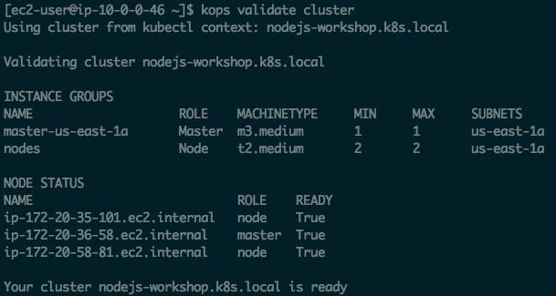
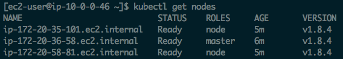

## 1. Connect to your development machine

If you don't already have an SSH session open, SSH to your development machine.

```
ssh -i ~/.ssh/<your key>.pem ec2-user@<your dev machine ip address>
```

Then change your current working directory to the project directory:

```
cd ~/nodejs-aws-workshop/5\ -\ Kubernetes\ \(kops\)/code
```

&nbsp;

&nbsp;

## 2. Install `kops` & `kubectl`

For this tutorial we will install `kops` as a tool to automate the provisioning and configuration of a Kubernetes cluster on your AWS account, and `kubectl` as a friendly interface for controlling the Kubernetes cluster and launching containers in it.

__Install kops:__

```
wget -O kops https://github.com/kubernetes/kops/releases/download/$(curl -s https://api.github.com/repos/kubernetes/kops/releases/latest | grep tag_name | cut -d '"' -f 4)/kops-linux-amd64
chmod +x ./kops
sudo mv ./kops /usr/local/bin/
```

__Install kubectl:__

```
wget -O kubectl https://storage.googleapis.com/kubernetes-release/release/$(curl -s https://storage.googleapis.com/kubernetes-release/release/stable.txt)/bin/linux/amd64/kubectl
chmod +x ./kubectl
sudo mv ./kubectl /usr/local/bin/kubectl
```

__Ensure that both tools are installed:__

```
kops version
kubectl version
```

&nbsp;

&nbsp;

## 3. Create an S3 bucket

`kops` uses an S3 bucket as a source of truth about the state and configuration of your Kubernetes cluster, so we must create the cluster for it to use:

```
aws s3api create-bucket \
    --bucket nodejs-k8s-store \
    --region us-east-1
```

_Note that you will need to substitute your own bucket name in the above command._

&nbsp;

&nbsp;

## 4. Create an SSH key

This will create an SSH key that can be used to access the Kubernetes machines. This could be the same SSH key as the key used to access the dev machine you are connected to, but for extra security we are going to give the K8s deployment its own key:

```
ssh-keygen -t rsa -b 4096 -C "your_email@example.com"
```


_Just press enter at each prompt given to accept the default values_

&nbsp;

&nbsp;

## 5. Launch Kubernetes cluster

__Set some environment details:__

```
export NAME=nodejs-workshop.k8s.local
export KOPS_STATE_STORE=s3://nodejs-k8s-store
```

__Create a cluster config:__

This will create a cluster configuration file in the cluster state store S3 bucket. It can be customized, but for now we will just use the default configuration.

```
kops create cluster \
    --zones us-east-1a \
    ${NAME}
```

__Build the cluster:__

```
kops update cluster ${NAME} --yes
```

&nbsp;

&nbsp;

## 6. Query state of the cluster

Run the following command to check the state of the Kubernetes cluster:

```
kops validate cluster
```

If you just launched your cluster using `kops create` it is normal to see failure and error messages for several minutes while the instances start up and download and install their components. Eventually you will see a success message similar to this however:



We also need to check to make sure that `kubectl` is able to connect to the cluster:

```
kubectl get nodes
```

You should see output similar to this:



&nbsp;

&nbsp;

## 7. Create a container registry for each service:

The container registry is going to store the docker container images for both microservices we will deploy:

```
aws ecr create-repository --repository-name characters --region us-east-1
aws ecr create-repository --repository-name locations --region us-east-1
```

You will get output similar to this:

```
{
    "repository": {
        "registryId": "[your account ID]",
        "repositoryName": "characters",
        "repositoryArn": "arn:aws:ecr:us-east-1:[your account ID]:repository/characters",
        "createdAt": 1507564672.0,
        "repositoryUri": "[your account ID].dkr.ecr.us-east-1.amazonaws.com/characters"
    }
}
```

Take note of the `repositoryUri` value in each response, as you will need to use it later.

Now authenticate with your repository so you have permission to push to it:

- Run `aws ecr get-login --no-include-email --region us-east-1`
- You are going to get a massive output starting with `docker login -u AWS -p ...`
- Copy this entire output, paste, and run it in the terminal.

You should see Login Succeeded

&nbsp;

&nbsp;

## 8. Build your images and push them to your registries:

 First build each service's container image:

```
docker build -t characters services/characters/.
docker build -t locations services/locations/.
```

Run `docker images` and verify that you see following two container images:

```
REPOSITORY                TAG                 IMAGE ID            CREATED              SIZE
locations                 latest              ef276a9ad40a        28 seconds ago       58.8 MB
characters                latest              702e42d339d9        About a minute ago   58.8 MB
```

Then tag the container images and push them to the repository:

```
docker tag characters:latest [your characters repo URI]:v1
docker tag locations:latest [your locations repo URI]:v1
```

Example:

```
docker tag characters:latest 209640446841.dkr.ecr.us-east-1.amazonaws.com/characters:v1
docker tag locations:latest 209640446841.dkr.ecr.us-east-1.amazonaws.com/locations:v1
```

Finally push the tagged images:

```
docker push [your characters repo URI]:v1
docker push [your locations repo URI]:v1
```

Example:

```
docker push 209640446841.dkr.ecr.us-east-1.amazonaws.com/characters:v1
docker push 209640446841.dkr.ecr.us-east-1.amazonaws.com/locations:v1
```

&nbsp;

&nbsp;

