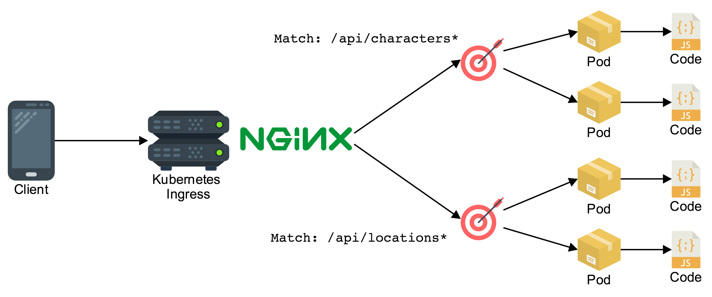
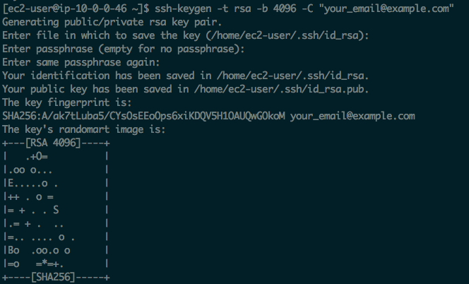

# Node.js deployed on AWS using Kubernetes



In this workshop we will deploy two microservices as containers running in a Kubernetes cluster. Traffic will reach the containers through a Kubernetes Ingress with Nginx routing traffic to the two different services based on the path of the request.

&nbsp;

&nbsp;

## 1. Connect to your development machine

If you have not done so already create [a development machine on AWS](../1%20-%20Development%20Environment) to do this
workshop.

If you don't already have an SSH session open, SSH to your development machine.

```
ssh -i ~/.ssh/<your key>.pem ec2-user@<your dev machine ip address>
```

If you haven't already done so clone the workshop code onto the dev machine:

```
cd ~
git clone https://github.com/nathanpeck/nodejs-aws-workshop.git
```

Then change your current working directory to the project directory:

```
cd ~/nodejs-aws-workshop/6\ -\ Kubernetes\ \(kops\)/code
```

&nbsp;

&nbsp;

## 2. Install `kops` & `kubectl`

For this tutorial we will install `kops` as a tool to automate the provisioning and configuration of a Kubernetes cluster on your AWS account, and `kubectl` as a friendly interface for controlling the Kubernetes cluster and launching containers in it.

__Install kops:__

```
wget -O kops https://github.com/kubernetes/kops/releases/download/$(curl -s https://api.github.com/repos/kubernetes/kops/releases/latest | grep tag_name | cut -d '"' -f 4)/kops-linux-amd64
chmod +x ./kops
sudo mv ./kops /usr/local/bin/
```

__Install kubectl:__

```
wget -O kubectl https://storage.googleapis.com/kubernetes-release/release/$(curl -s https://storage.googleapis.com/kubernetes-release/release/stable.txt)/bin/linux/amd64/kubectl
chmod +x ./kubectl
sudo mv ./kubectl /usr/local/bin/kubectl
```

__Ensure that both tools are installed:__

```
kops version
kubectl version
```

&nbsp;

&nbsp;

## 3. Create an S3 bucket

`kops` uses an S3 bucket as a source of truth about the state and configuration of your Kubernetes cluster:

```
aws s3api create-bucket \
    --bucket nodejs-k8s-store \
    --region us-east-1
```

_Note that you will need to substitute your own bucket name in the above command._

&nbsp;

&nbsp;

## 4. Create an SSH key

This will create an SSH key that can be used to access the Kubernetes machines. This could be the same SSH key as the key used to access the dev machine you are connected to, but for extra security we are going to give the K8s deployment its own key:

```
ssh-keygen -t rsa -b 4096 -C "your_email@example.com"
```



_Just press enter at each prompt given to accept the default values_

&nbsp;

&nbsp;

## 5. Launch Kubernetes cluster

__Set some environment details:__

```
export NAME=nodejs-workshop.k8s.local
export KOPS_STATE_STORE=s3://nodejs-k8s-store
```

__Create a cluster config:__

This will create a cluster configuration file in the cluster state store S3 bucket. It can be customized, but for now we will just use the default configuration.

```
kops create cluster \
    --zones us-east-1a \
    ${NAME}
```

__Build the cluster:__

```
kops update cluster ${NAME} --yes
```

After kops finishes kicking off the cluster launch you will see output like this:

```
Cluster is starting.  It should be ready in a few minutes.
```

&nbsp;

&nbsp;

## 6. Query state of the cluster

Run the following command to check the state of the Kubernetes cluster:

```
kops validate cluster
```

If you just launched your cluster using `kops create` it is normal to see a message similar to this:

- `no such host`
- `your masters are NOT ready`
- `your nodes are NOT ready`

These are not fatal errors, they just mean the instances still need time to start up, download and install their components. Eventually you will see a success message similar to this:

```
Validating cluster nodejs-workshop.k8s.local

INSTANCE GROUPS
NAME                ROLE    MACHINETYPE MIN MAX SUBNETS
master-us-east-1a   Master  m3.medium   1   1   us-east-1a
nodes               Node    t2.medium   2   2   us-east-1a

NODE STATUS
NAME                            ROLE    READY
ip-172-20-39-193.ec2.internal   master  True
ip-172-20-40-154.ec2.internal   node    True
ip-172-20-62-145.ec2.internal   node    True

Your cluster nodejs-workshop.k8s.local is ready
```

This means that the Kubernets cluster is ready to use. We just need to check to make sure that `kubectl` is able to connect to the cluster:

```
kubectl get nodes
```

You should see output similar to this:

```
NAME                            STATUS    ROLES     AGE       VERSION
ip-172-20-39-193.ec2.internal   Ready     master    3m        v1.8.6
ip-172-20-40-154.ec2.internal   Ready     node      1m        v1.8.6
ip-172-20-62-145.ec2.internal   Ready     node      1m        v1.8.6
```

&nbsp;

&nbsp;

## 7. Create a container registry for each service

The container registry is going to store the docker container images for both microservices we will deploy:

```
aws ecr create-repository --repository-name characters --region us-east-1
aws ecr create-repository --repository-name locations --region us-east-1
```

You will get output similar to this:

```
{
    "repository": {
        "registryId": "[your account ID]",
        "repositoryName": "characters",
        "repositoryArn": "arn:aws:ecr:us-east-1:[your account ID]:repository/characters",
        "createdAt": 1507564672.0,
        "repositoryUri": "[your account ID].dkr.ecr.us-east-1.amazonaws.com/characters"
    }
}
```

Take note of the `repositoryUri` value in each response, as you will need to use it later.

Now authenticate with your repository so you have permission to push to it:

- Run `aws ecr get-login --no-include-email --region us-east-1`
- You are going to get a massive output starting with `docker login -u AWS -p ...`
- Copy this entire output, paste, and run it in the terminal.

You should see `Login Succeeded`

&nbsp;

&nbsp;

## 8. Build your images and push them to your registries

 First build each service's container image:

```
docker build -t characters services/characters/.
docker build -t locations services/locations/.
```

Run `docker images` and verify that you see following two container images:

```
REPOSITORY                TAG                 IMAGE ID            CREATED              SIZE
locations                 latest              ef276a9ad40a        28 seconds ago       58.8 MB
characters                latest              702e42d339d9        About a minute ago   58.8 MB
```

Then tag the container images and push them to the repository:

```
docker tag characters:latest [your characters repo URI]:v1
docker tag locations:latest [your locations repo URI]:v1
```

Example:

```
docker tag characters:latest 209640446841.dkr.ecr.us-east-1.amazonaws.com/characters:v1
docker tag locations:latest 209640446841.dkr.ecr.us-east-1.amazonaws.com/locations:v1
```

Finally push the tagged images:

```
docker push [your characters repo URI]:v1
docker push [your locations repo URI]:v1
```

Example:

```
docker push 209640446841.dkr.ecr.us-east-1.amazonaws.com/characters:v1
docker push 209640446841.dkr.ecr.us-east-1.amazonaws.com/locations:v1
```

&nbsp;

&nbsp;

## 9. Modify deployment specification files

Modify the files at `recipes/locations.yml` and `recipes/characters.yml` to have the docker image URL from the last step (including the image tag).

Choose one of the following command line file editors to use:

- `nano recipes/locations.yml` (Easier to use editor. Just edit file and then press Control + O to write the file to disk, and Control + X to exit.)
- `vi recipes/locations.yml` (Advanced editor. Press `a` to enter insert mode, edit the file, then press Escape to exit edit mode. Type `:wq` to write the file to disk and quit.)

Whichever editor you use you need to change the `image` property to the URI of your docker image as shown below:

```
spec:
  containers:
  - name: locations
    image: 209640446841.dkr.ecr.us-east-1.amazonaws.com/locations:v1
    ports:
    - containerPort: 8081
```

Repeat this for both the locations deployment definition file and the characters deployment definition, putting the appropriate image URL in each file.

&nbsp;

&nbsp;

## 10. Apply the deployments to the Kubernetes cluster

Run the command to apply these two deployments to your Kubernetes cluster:

```
kubectl apply -f recipes/locations.yml
kubectl apply -f recipes/characters.yml
```

Then verify that the deployments have applied:

```
kubectl get deployments
```

You should see output similar to this:

```
NAME                    DESIRED   CURRENT   UP-TO-DATE   AVAILABLE   AGE
characters-deployment   2         2         2            0           7s
locations-deployment    2         2         2            2           7s
```

We also just created services for the pods, which serve as proxies that
will allow us to send traffic to the underlying pods wherever they may
be:

```
kubectl get services
```

You should see output similar to this:

```
NAME                 TYPE        CLUSTER-IP      EXTERNAL-IP   PORT(S)    AGE
characters-service   ClusterIP   100.64.79.235   <none>        8081/TCP   41s
kubernetes           ClusterIP   100.64.0.1      <none>        443/TCP    3h
locations-service    ClusterIP   100.64.78.26    <none>        8081/TCP   41s
```

&nbsp;

&nbsp;

## 11. Create a load balancer in front of your pods

Now that the pods are running on the cluster, we still need a way for traffic from the public to reach them. In order to do this we will build an Nginx container that can route traffic to the containers, and then expose the Nginx to the public using a load balancer ingress.

__Build and push the Nginx image:__

```
aws ecr create-repository --repository-name nginx-router --region us-east-1
docker build -t nginx-router services/nginx/.
docker tag nginx-router:latest <your repo url>:v1
docker push <your repo url>:v1
```

__Modify the Nginx deployment file:__

Use the editor of your choice to edit the file at `recipes/nginx.yml` to have the URL of the Nginx image, exactly as you did in step #9 for the `locations` and `characters` services.

__Apply the deployment:__

```
kubectl apply -f recipes/nginx.yml
```

__Get the details of the load balancer:__

```
kubectl describe service nginx-router
```

You will see output like:

```
[ec2-user@ip-10-0-0-46 code]$ kubectl describe service nginx-router
Name:                     nginx-router
Namespace:                default
Labels:                   <none>
Annotations:              kubectl.kubernetes.io/last-applied-configuration={"apiVersion":"v1","kind":"Service","metadata":{"annotations":{},"name":"nginx-router","namespace":"default"},"spec":{"ports":[{"port":80,"targetPort":...
Selector:                 app=nginx-router
Type:                     LoadBalancer
IP:                       100.69.165.186
LoadBalancer Ingress:     aa788cc64fc9911e7b8820e801320750-1559002290.us-east-1.elb.amazonaws.com
Port:                     <unset>  80/TCP
TargetPort:               80/TCP
NodePort:                 <unset>  31419/TCP
Endpoints:
Session Affinity:         None
External Traffic Policy:  Cluster
Events:
  Type    Reason                Age   From                Message
  ----    ------                ----  ----                -------
  Normal  EnsuringLoadBalancer  1m    service-controller  Ensuring load balancer
  Normal  EnsuredLoadBalancer   1m    service-controller  Ensured load balancer
```

Make a note of the value listed for `LoadBalancer Ingress`. This is the DNS name that the application will be available to the public as.

&nbsp;

&nbsp;

## 12. Test the service

Make an HTTP request to the service on the DNS name from the last step. Note that it make take a minute or so before the load balancer ingress actually starts accepting traffic.

```
curl http://aa788cc64fc9911e7b8820e801320750-1559002290.us-east-1.elb.amazonaws.com/api/characters
curl http://aa788cc64fc9911e7b8820e801320750-1559002290.us-east-1.elb.amazonaws.com/api/locations
```

These two paths are each being served by their own container deployment in the Kubernetes cluster.

&nbsp;

&nbsp;

## 13. Scale a service

There are three pieces to this Kubernetes architecture that we can scale:

- The NGINX router deployment
- The `characters` deployment
- The `locations` deployment

Scaling a deployment is easy with the following command:

```
kubectl scale --replicas=3 deployments/characters-deployment
```

This will increase the number of `characters` containers to three, which you can verify using `kubectl get pods`:

```
characters-deployment-6c6846f98-m54bn   1/1       Running   0          38m
characters-deployment-6c6846f98-p4r6x   1/1       Running   0          38m
characters-deployment-6c6846f98-xcmld   1/1       Running   0          39s
locations-deployment-76c6657869-9slws   1/1       Running   0          40m
locations-deployment-76c6657869-zbkzz   1/1       Running   0          40m
nginx-router-d4dd9c94c-jxtfw            1/1       Running   0          15m
nginx-router-d4dd9c94c-wt7b5            1/1       Running   0          15m
```

You will now see three pods with the `characters` name, alongside the existing two for `locations` and `nginx-router`.

&nbsp;

&nbsp;

## 14. Shutdown the cluster

When you are done experimenting with your Kubernetes cluster you can destroy it by using kops to terminate it.

```
kops delete cluster --name nodejs-workshop.k8s.local
```

This command will list out the resources to be deleted. After you verify that you are deleting the right cluster you can repeat the command with an added `--yes` flag to accept the deletion.

```
kops delete cluster --name nodejs-workshop.k8s.local --yes
```

If you do not plan to relaunch this cluster you can also delete the S3 bucket that you created earlier:

```
aws s3api delete-bucket \
    --bucket nodejs-k8s-store \
    --region us-east-1
```

And delete the ECR repositories that you created to store the microservice docker images:

```
aws ecr delete-repository --repository-name characters --force --region us-east-1
aws ecr delete-repository --repository-name locations --force --region us-east-1
aws ecr delete-repository --repository-name nginx-router --force --region us-east-1
```
